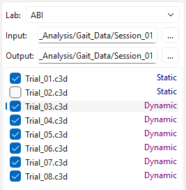
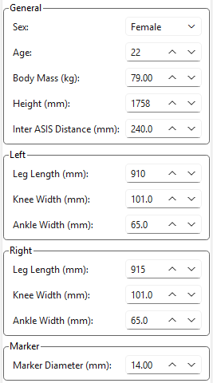
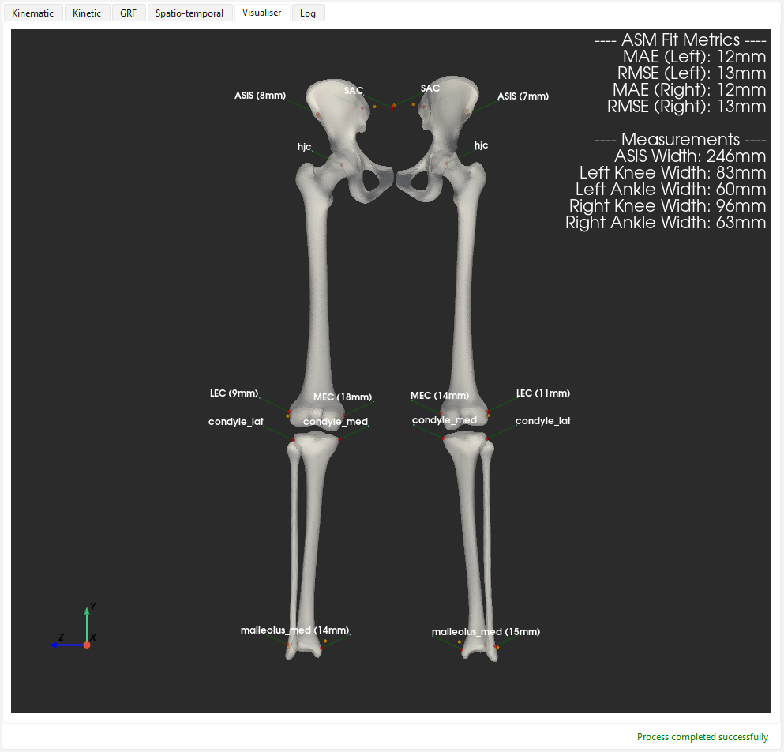
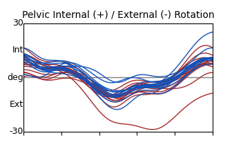
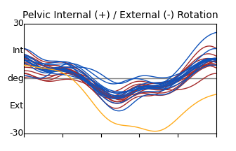
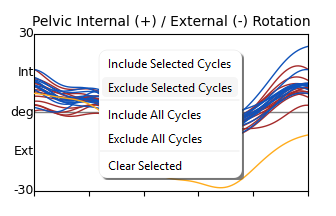
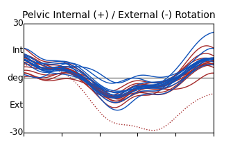
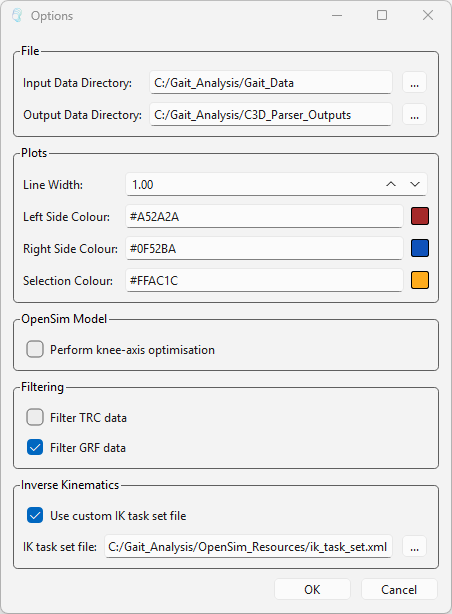
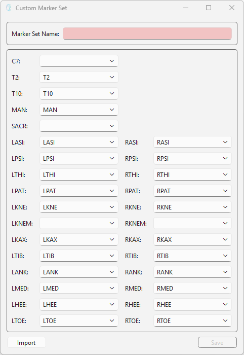

# C3D-Parser

The C3D-Parser is a Python desktop application for gait analysis.

Given a C3D motion capture session, the C3D-Parser generates a personalised OpenSim lower-limb
model using an articulated shape model. It then uses this model to run inverse kinematics,
inverse dynamics, and spatio-temporal analysis using the OpenSim API.

The entire process runs locally and offline.

## Contents

- [Installation](#installation)
- [Usage](#usage)
- [Options](#options)
- [Custom Marker Sets](#custom-marker-sets)
- [Input Requirements](#input-requirements)
- [Feature Requests and Bug Reports](#feature-requests-and-bug-reports)

## Installation

#### Installing the Windows executable (recommended):

The latest release of the C3D-Parser includes a Windows installer for setting up an executable
version of the application. Simply download and run _C3D-Parser-{release-version}.exe_ for any
release in the GitHub repository [_Releases_](https://github.com/tsalemink/C3D-parser/releases).

#### Installing the Python package:

It is recommended that you create a new virtual environment before installing this package, to
avoid any potential dependency conflicts with the packages already installed in your Python
environment.

If you intend to use this package directly from your Python environment you will also need to
install the OpenSim Python distribution yourself. This can be installed using Conda, or by building
the Python bindings from source. Development and testing have been done using Python 3.11 and
OpenSim 4.5, so we recommend installing those releases if possible. Though most recent Python and
OpenSim versions should work as well.

After activating your Python environment and installing OpenSim you can run
`pip install c3d-parser` to install the application. It can then be started by running the command
`c3d_parser`.

## Usage

**Setup**  
Before you can start processing a gait session, you need to define your lab's marker-set using the
"Lab" drop-down on the main-window. If this is your first time using the C3D-Parser please read
the section on [custom marker sets](#custom-marker-sets). 

**1. Select Input Session**  
Select your gait session using the "Input" line-edit or associated directory chooser. Each trial
in the session will be automatically classified as "Static" or "Dynamic", but you can override
these classifications by right-clicking on the item in question. You can exclude specific trials
from the analysis by using the check-boxes provided.

  

You can also specify an "Output" directory if you wish. By default, an output structure will be
created in your input directory.

**2. Confirm Anthropometric Data**  
Next, check the subject's anthropometric measurements. This information should be automatically
filled using the metadata in your static C3D file. Confirm these values are accurate and fill in
any gaps.

  

**3. Processing**  
Click "Process Data" to begin.

The application will create an OpenSim model using your input data and will run IK and ID. The
results from IK and ID will be displayed in the "Kinematic" and "Kinetic" tabs respectively.
The visualisation tab displays the generated model and the predicted landmark positions, comparing
these against the (skin-padding adjusted) experimental marker positions.

  

**4. Quality Control**  

Check that the model looks sensible and that the differences in marker positions aren't too large.
Note that the width values provided here are between bone-surface landmarks, so should be slightly
smaller than your experimental measurements.

The last thing to do is to decide which gait cycles you wish to include in your final outputs.
By default, your results will include the data produced for every gait cycle in your session.
If it looks like there are cycles missing, please read the section on
[input requirements](#input-requirements).

To exclude a gait cycle from your results: click on the curve, right-click the plot area, and
select "Exclude Selected Cycles". Similarly, it is also possible to exclude/include entire
sections of data for specific trials by right-clicking on the trial name in the list of trials.

  
  

  
  

The "Spatio-temporal" tab supports exclusions in the same manner.

Click "Finalise Outputs" to produce the final results.

## Options

User settings are available under _View_ -> _Options_.
All settings are retained after you close the application.

  

**File**  
_Input Data Directory_ and _Output Data Directory_ define the default starting directories for the
_Input_ and _Output_ directory choosers on the main window.

**Plots**  
_Line Width_ refers to the width of the lines displayed on the graphs in the visualisation tabs.

Plot colours can be adjusted using colour hex codes. Please ensure the selection colour is
distinct from the left and right side colours.

**OpenSim Model**  
After creating the initial OpenSim model, an optional knee axis optimisation can be run to refine
the model prior to analysis. This process is time-consuming and can be disabled for testing
purposes.

**Filtering**  
If the filtering check boxes are selected, the C3D-Parser will filter (8Hz Butterworth low-pass)
the TRC and GRF inputs before running the rest of the workflow. If your inputs are pre-filtered,
please deselect these options.

**Inverse Kinematics**  
If you wish to define custom marker weights, you may do so by providing your own IK task set file.
Please follow the format used in the C3D-Parser
[default IK task set](src/c3d_parser/core/osim_resources/ik_task_set.xml).

## Custom Marker Sets

The application pre-defines a number of lab-specific marker sets. If the marker sets we provide do
not fit your needs you can adjust one of the existing marker sets or create a new one from scratch
using the custom marker set dialog under "Marker" -> "Custom Marker Set".

  

You can import an initial mapping from one of the existing marker sets using the "Import" button.

We recommend that you specify your input session directory (using the "Input" line-edit in the main
window) before opening the custom marker set dialog, this way the drop-down menu associated with
each required marker will be populated with the list of markers defined in your static trial.
Otherwise, you will have to type in the marker names manually, which is time-consuming and prone
to errors. The dialog will also attempt to match any commonly named markers that it identifies in
your static trial.

Your custom marker set must define: "ASI", "KNE", "ANK", "MED", "HEE", either "PSI" or "SACR",
either "KNEM" or "KAX".

## Input Requirements

To be able to create an OpenSim model from your static C3D file, it must contain either: medial
knee markers; or KAD markers as well as knee-width values in the C3D metadata PROCESSING section
(so that we can calculate virtual positions for the medial markers based on the lateral knee marker
positions).

It is recommended that your static C3D file defines the subject's height and weight in the metadata
PROCESSING section, otherwise you will be prompted for this information.

Additionally, to be able to cover a wide range of inputs whilst keep the UI as minimal as possible,
we have had to adopt a fairly strict policy on what is considered a 'valid' gait event. If a foot
strike occurs over multiple force plates, we will be unable to use the GRF data associated with
that stance phase. This will also affect which gait cycles are considered valid when normalising
the results from ID.

## Feature Requests and Bug Reports

If you would like to suggest a new feature for this application or report a bug you have discovered, please create a
"New Issue" using the appropriate template found in this repository's 
[_Issues_](https://github.com/tsalemink/C3D-parser/issues) page. Please check that your request does not match any 
existing issues.

Ongoing development of features and bug fixes can be tracked using the development 
[_Project_](https://github.com/users/tsalemink/projects/3) for this repository.
